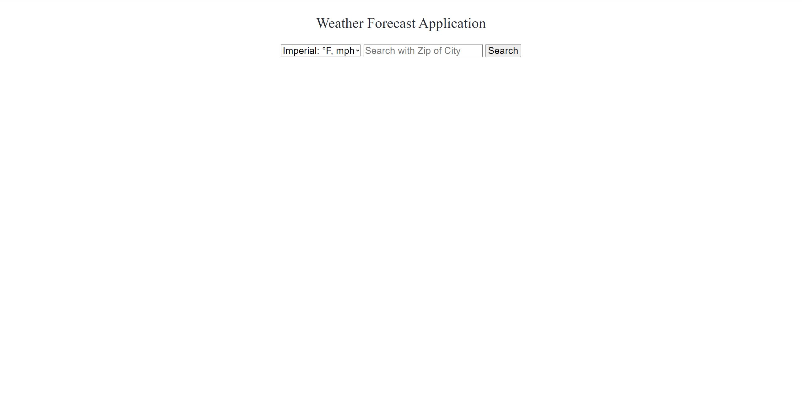
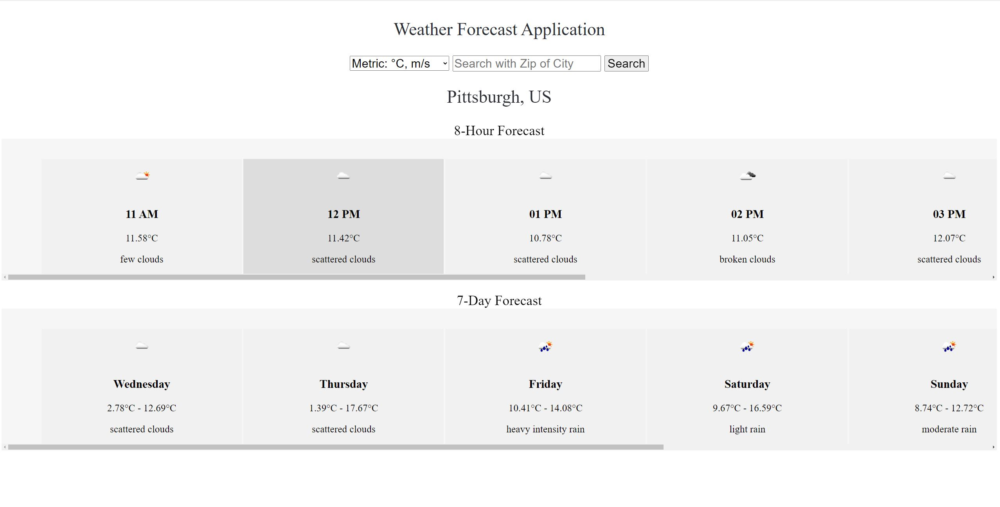

## Requirements
```
python3 -m pip install --upgrade pip
python3 -m pip install django
```

## Local Deployment
```
python3 manage.py migrate
python3 manage.py runserver
```
Get "config.ini" file from author, put it under the root dir. 

## APIs
One Call API 3.0: https://openweathermap.org/api/one-call-3  
Geocoding API: https://openweathermap.org/api/geocoding-api

## UI


